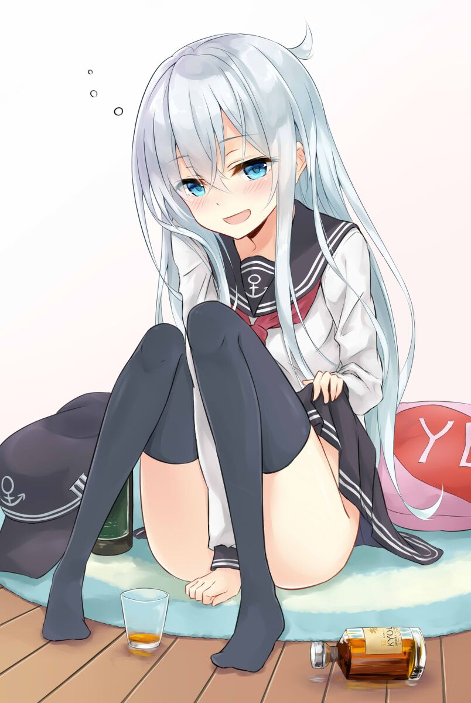

# FontVideo

Play video by fonts in a console window by composing characters.

Using FFmpeg API to decode the input file, then the video stream is rendered to the specified output, and the audio stream is played via `libsoundio`.

Default is output to `stdout`, but you can specify its output to a file.

## Usage:

	Usage: FontVideo.exe -i <input> [-o <output.txt>] [-v] [-p <seconds>] [-m] [-w <width>] [-h <height>] [-s <width> <height>] [-S <from_sec>] [-b] [--invert-color] [--no-opengl] [--no-frameskip] [--assets-meta <metafile.ini>] [--output-frame-image-sequence <prefix>]
	Or: FontVideo.exe <input>
		-i: Specify the input video file name.
		-o: [Optional] Specify the output text file name.
		-v: [Optional] Verbose mode, output debug informations.
		  Alias: --verbose
		-p: [Optional] Specify pre-render seconds, Longer value results longer delay but better quality.
		  Alias: --pre-render
		-m: [Optional] Mute sound output.
		  Aliases: --mute, --no-sound, --no-audio
		-w: [Optional] Width of the output.
		  Alias: --width
		-h: [Optional] Height of the output.
		  Alias: --height
		-s: [Optional] Size of the output, default is to detect the size of the console window, or 80x25 if failed.
		  Alias: --size
		-b: Only do white-black output.
		  Alias: --black-white
		-S: [Optional] Set the playback start time of seconds.
		  Alias: --start-time
		--log: [Optional] Specify the log file.
		--invert-color: [Optional] Do color invert.
		--no-opengl: [Optional] Do not use OpenGL to accelerate rendering.
		--no-frameskip: [Optional] Do not skip frames, which may cause video and audio could not sync.
		--assets-meta: [Optional] Use specified meta file, default is to use 'assets\meta.ini'.
		--output-frame-image-sequence: [Optional] Output each frame image to a directory. The format of the image is `bmp`.

## Demo

	                                                    
	                                                    
	                                                    
	                                                    
	                                                    
	                                                    
	                                                    
	                                 '                  
	                             _                      
	                          m#%%                      
	                    M%M                             
	                  '              g_                 
	                             y   ggC%gw_            
	                        Ymw %    ggg'7/             
	                       { Qg;ww_  %%7 '   '          
	                         ]gQgmg  g7''               
	                        ! OQUQg  _W#                
	                    !_ggggQQg_;  '#                 
	                 ggg_ggggggQgkAk '   '              
	               _gggggYggggQgg%            [         
	              ggggggg ggggg%ggg_                    
	             gggggggg[%ggggg%gg%y _   '             
	        _gggggggggg%g]'gggggQggggWgQ__g             
	    __gggggggggggggggg Qgggggggggg%_%ggg     mW    q
	 _gggg%%gggQgggggggggg  gggggggggg#%QWggg_  ]gyA''-M
	ggggggggggggggggQggggQ  ]gggggggg#   'gggg  ?%      
	gggggggggQQgggg   ''''   gggg%%#'     %gggC  ' g_gg}
	%QggggggCYggggQ          %ggg[        g-%Qg    'M#gg
	qggggg%#[QggQgQ        [ 3ggg[         %gQgy        
	]ggggggg%ggQ%gQ        !  ggg}          ]gMg_       
	ggg%%%%QgggQggg9k      !  ]gg]          ggg_Mggc  ''
	ggggggggggMMMM'         %%%ggg         /   'Mw[#g7  
	MM%Q%Mggg[              '''gggy                     
	M;    ggg                  gggQ                     
	   7mggggE                 Q%ggk                    
	     %ggg%gmw             ]ggggg                   _
	    ;MM#%% _w'/YY'_7''7YMg%ggggkmmw wgggg    gg M]  
	 ;-'     ;K   '''y'    MgggggQ''   ;Umgggggggg#_ q  
	'      w'       '      y'' '' /     qWQ%#%%%%#Y%WM  
	     Y        /       /      y      /  ''''['''  M  

